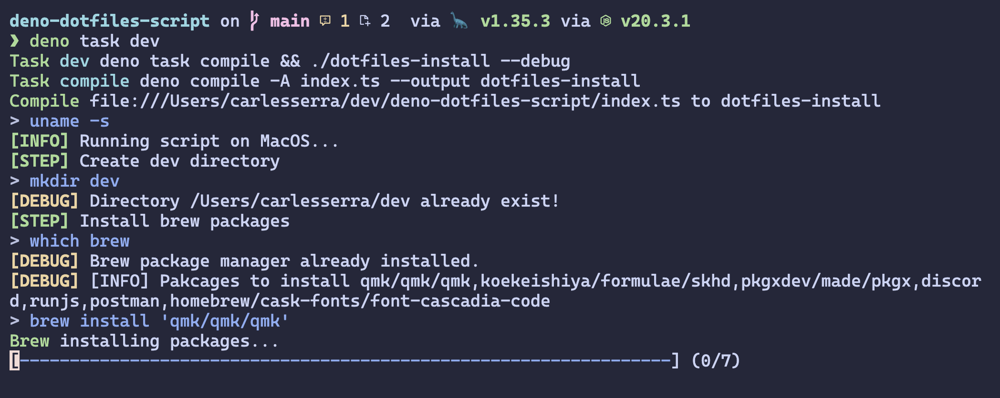

# Deno script to install my .dotfiles repository



## Launch install script

This script idempotent, should work even if already installed!

- Open terminal
  - Execute
    1. Update and setup macos config
       `curl https://raw.githubusercontent.com/carseven/.dotfiles/main/setup/scripts/macos.sh | sh`
    2. Install all application and packages
       `curl -L https://github.com/carseven/deno-dotfiles-script/releases/download/v0.1.0-alpha/dotfiles-install -O && chmod +x dotfiles-install && ./dotfiles-install`

## Development

Install deno, an alternative to nodejs javascript runtime by the same creator. By default, supports typescript out of the box, it's own linter... Find more info https://deno.com

```bash
brew install deno
```

### Main scripts

```bash
# Run script with debug mode
deno task dev

# Compile binary of the script
deno task compile
```

### Flags

### debug

Show info about commands launch and output of all the commands to debug problems

```bash
./dotfiles-install -d
./doftiles-install --debug
```

## TODO

- [ ] COnfig files could be un update from dotfiles repo (Maybe a config JSON o yml file?) 
- [ ] Add linux setup
- [ ] Add tags, been able to install only certain tasks of the script (Like ansible)
- [ ] Add CD of the binary SEM version
- [ ] Add unit test and e2e testing
- [ ] Add CI test to assure script launch properly on each OS and is idempotent
- [ ] Add help flag to show more options
